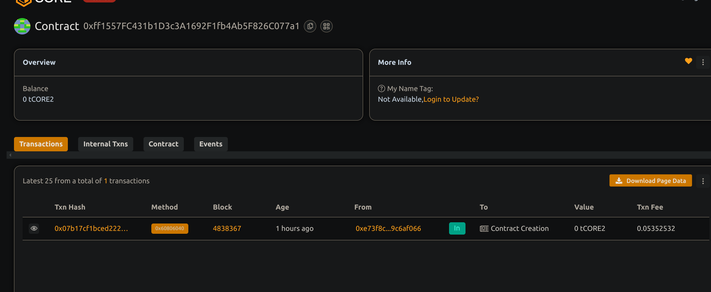

# Community treasury management system

## Project Description       

A decentralized platform for managing community funds where members can propose spending, vote on proposals, and execute approved fund disbursements transparently on-chain.

## Project Vision

To empower communities with full control and transparency over their shared treasury, fostering trust and collaborative decision-making without intermediaries.

## Key Features 

- ✅ Member onboarding controlled by the owner
- ✅ Proposal creation for fund allocation
- ✅ Democratic voting system with support/against votes
- ✅ Secure execution of approved proposals
- ✅ Native Ether handling within the contract

## Future Scope

- Adding quorum and vote weighting based on member stakes
- Multi-signature wallet integration for enhanced security
- Proposal discussion forums integrated with off-chain systems
- DAO governance token integration for voting power delegation

## Contract details
0xff1557FC431b1D3c3A1692F1fb4Ab5F826C077a1
MADE BY :- Aman likhar
